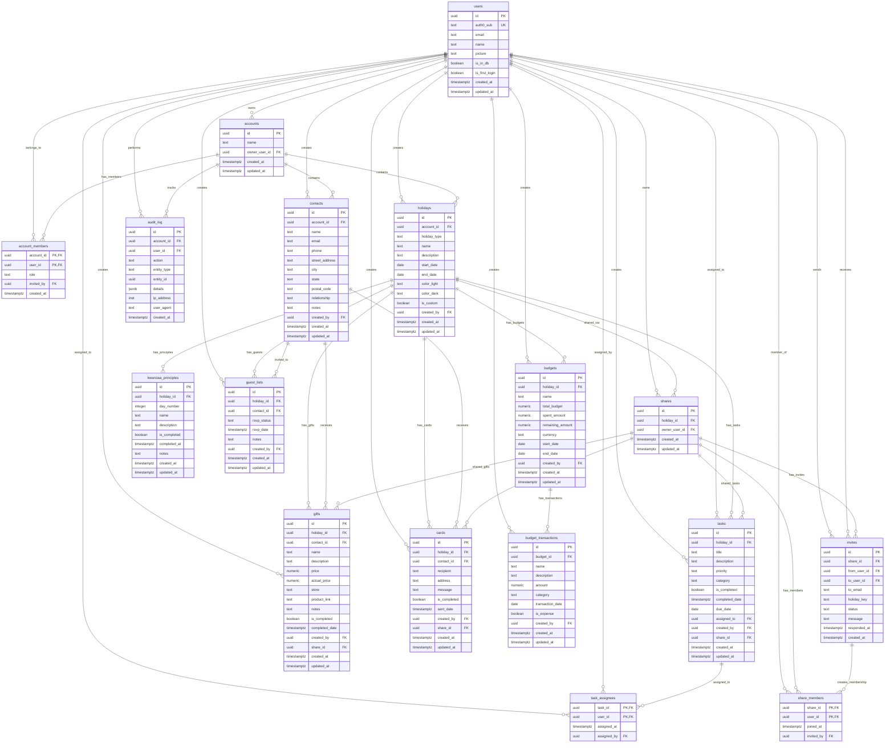

# Entity Relationship Diagram

## Key Relationships

1. **Multi-tenant Architecture**: All data is scoped to `accounts` through foreign key relationships
2. **User Collaboration**: Users can belong to multiple accounts and collaborate on holidays
3. **Holiday-Centric Design**: All planning entities (tasks, gifts, cards, budgets) are linked to holidays
4. **Contact Management**: Centralized contacts used across gifts, cards, and guest lists
5. **Sharing System**: Shares enable collaboration on specific holidays with invitation workflow
6. **Audit Trail**: Comprehensive logging of all user actions for security and debugging

## Notes

- All primary keys are UUIDs for security and scalability
- Foreign keys use `ON DELETE CASCADE` where child records shouldn't outlive parents
- Timestamps use `timestamptz` for timezone awareness
- Money fields use `numeric(12,2)` for precision
- The schema supports both individual and collaborative holiday planning
- Auth0 integration is handled through the `auth0_sub` field in users table
