# Entity Relationship Diagram

**📊 [View Live Interactive ERD](https://mermaid.ai/app/projects/5a13959b-bcd3-4844-834d-1f664ae6f043/diagrams/3605b52a-9a41-4a09-a764-2c6ee2d62a92/version/v0.1/edit)** - Click to view and interact with the full database schema

## Database Schema Visualization

The following Mermaid ERD represents the current MySQL database schema for the Next Holiday application as implemented via Prisma ORM.

```mermaid
erDiagram
    users {
        char36 id PK
        varchar191 auth0Sub UK
        varchar191 email
        varchar191 name
        text picture
        boolean isInDb
        boolean isFirstLogin
        enum subscriptionPlan
        datetime3 subscriptionStartDate
        datetime3 subscriptionEndDate
        datetime3 createdAt
        datetime3 updatedAt
    }

    user_preferences {
        char36 id PK
        char36 userId FK,UK
        varchar191 theme
        varchar191 displayMode
        boolean showCompletedItems
        boolean showCountdown
        boolean showProgressBars
        boolean emailNotifications
        boolean pushNotifications
        boolean reminderNotifications
        boolean taskDueReminders
        boolean holidayCountdownAlerts
        varchar191 timezone
        varchar191 locale
        boolean reducedMotion
        boolean highContrast
        varchar191 fontSize
        datetime3 createdAt
        datetime3 updatedAt
    }

    accounts {
        char36 id PK
        varchar191 name
        char36 ownerUserId FK
        datetime3 createdAt
        datetime3 updatedAt
    }

    account_members {
        char36 accountId PK,FK
        char36 userId PK,FK
        enum role
        char36 invitedBy FK
        datetime3 createdAt
    }

    holidays {
        char36 id PK
        char36 accountId FK
        varchar191 holidayType
        varchar191 name
        text description
        date startDate
        date endDate
        datetime3 countdownTimer
        varchar191 colorLight
        varchar191 colorDark
        boolean isCustom
        char36 createdBy FK
        datetime3 createdAt
        datetime3 updatedAt
    }

    contacts {
        char36 id PK
        char36 accountId FK
        varchar191 name
        varchar191 email
        varchar191 phone
        varchar191 streetAddress
        varchar191 city
        varchar191 state
        varchar191 postalCode
        varchar191 relationship
        text notes
        char36 createdBy FK
        datetime3 createdAt
        datetime3 updatedAt
    }

    tasks {
        char36 id PK
        char36 holidayId FK
        varchar191 title
        text description
        enum priority
        varchar191 category
        boolean isCompleted
        datetime3 completedDate
        date dueDate
        char36 assignedTo FK
        char36 createdBy FK
        char36 shareId FK
        datetime3 createdAt
        datetime3 updatedAt
    }

    task_assignees {
        char36 taskId PK,FK
        char36 userId PK,FK
        datetime3 assignedAt
        char36 assignedBy FK
    }

    gifts {
        char36 id PK
        char36 holidayId FK
        char36 contactId FK
        varchar191 name
        text description
        decimal price
        decimal actualPrice
        varchar191 store
        text productLink
        text notes
        boolean isCompleted
        datetime3 completedDate
        char36 createdBy FK
        char36 shareId FK
        datetime3 createdAt
        datetime3 updatedAt
    }

    cards {
        char36 id PK
        char36 holidayId FK
        char36 contactId FK
        varchar191 recipient
        text address
        text message
        boolean isCompleted
        datetime3 sentDate
        char36 createdBy FK
        char36 shareId FK
        datetime3 createdAt
        datetime3 updatedAt
    }

    budgets {
        char36 id PK
        char36 holidayId FK
        varchar191 name
        decimal totalBudget
        decimal spentAmount
        decimal remainingAmount
        varchar191 currency
        date startDate
        date endDate
        char36 createdBy FK
        datetime3 createdAt
        datetime3 updatedAt
    }

    budget_transactions {
        char36 id PK
        char36 budgetId FK
        varchar191 name
        text description
        decimal amount
        varchar191 category
        date transactionDate
        boolean isExpense
        char36 createdBy FK
        datetime3 createdAt
        datetime3 updatedAt
    }

    shares {
        char36 id PK
        char36 holidayId FK,UK
        char36 ownerUserId FK
        datetime3 createdAt
        datetime3 updatedAt
    }

    share_members {
        char36 shareId PK,FK
        char36 userId PK,FK
        datetime3 joinedAt
        char36 invitedBy FK
    }

    invites {
        char36 id PK
        char36 shareId FK
        char36 fromUserId FK
        char36 toUserId FK
        varchar191 toEmail
        varchar191 holidayKey
        enum status
        text message
        datetime3 respondedAt
        datetime3 createdAt
        datetime3 senderDismissedAt
    }

    kwanzaa_principles {
        char36 id PK
        char36 holidayId FK
        int dayNumber
        varchar191 name
        text description
        boolean isCompleted
        datetime3 completedAt
        text notes
        datetime3 createdAt
        datetime3 updatedAt
    }

    guest_lists {
        char36 id PK
        char36 holidayId FK
        char36 contactId FK
        enum rsvpStatus
        datetime3 rsvpDate
        text notes
        char36 createdBy FK
        datetime3 createdAt
        datetime3 updatedAt
    }

    audit_log {
        char36 id PK
        char36 accountId FK
        char36 userId FK
        varchar191 action
        varchar191 entityType
        char36 entityId
        json details
        varchar191 ipAddress
        text userAgent
        datetime3 createdAt
    }

    %% Core User Relationships
    users ||--o| user_preferences : "has_preferences"
    users ||--o{ accounts : "owns"
    users ||--o{ account_members : "member_of"
    users ||--o{ account_members : "invites"

    %% Account Structure
    accounts ||--o{ account_members : "has_members"
    accounts ||--o{ holidays : "contains"
    accounts ||--o{ contacts : "manages"
    accounts ||--o{ audit_log : "tracks_activity"

    %% Holiday Planning Core
    holidays ||--o{ tasks : "has_tasks"
    holidays ||--o{ gifts : "has_gifts"
    holidays ||--o{ cards : "has_cards"
    holidays ||--o{ budgets : "has_budgets"
    holidays ||--o| shares : "shared_via"
    holidays ||--o{ kwanzaa_principles : "has_principles"
    holidays ||--o{ guest_lists : "has_guests"

    %% Contact Management
    contacts ||--o{ gifts : "recipient_of"
    contacts ||--o{ cards : "recipient_of"
    contacts ||--o{ guest_lists : "invited_as"

    %% Task Management
    tasks ||--o{ task_assignees : "assigned_to_multiple"
    users ||--o{ tasks : "assigned_individual_tasks"
    users ||--o{ tasks : "created_tasks"
    users ||--o{ task_assignees : "assigned_to"
    users ||--o{ task_assignees : "assigned_by"

    %% Budget Management
    budgets ||--o{ budget_transactions : "has_transactions"
    users ||--o{ budgets : "created_budgets"
    users ||--o{ budget_transactions : "created_transactions"

    %% Sharing & Collaboration
    shares ||--o{ share_members : "has_members"
    shares ||--o{ invites : "manages_invites"
    shares ||--o{ tasks : "shared_tasks"
    shares ||--o{ gifts : "shared_gifts"
    shares ||--o{ cards : "shared_cards"
    users ||--o{ shares : "owns_shares"
    users ||--o{ share_members : "member_of_shares"
    users ||--o{ share_members : "invited_members"
    users ||--o{ invites : "sends_invites"
    users ||--o{ invites : "receives_invites"

    %% Creation Tracking
    users ||--o{ holidays : "creates"
    users ||--o{ contacts : "creates"
    users ||--o{ gifts : "creates"
    users ||--o{ cards : "creates"
    users ||--o{ guest_lists : "creates"
    users ||--o{ audit_log : "performs_actions"
```

## Schema Architecture

### Multi-Tenant Design

- **Accounts**: Top-level organizational unit (families, households, friend groups)
- **Account Members**: Flexible role-based membership system
- **Data Isolation**: All planning data scoped to accounts for privacy

### Holiday Planning Ecosystem

- **Holidays**: Central entity supporting 15+ holiday types plus custom holidays
- **Tasks**: Comprehensive task management with priorities, categories, and assignments
- **Gifts**: Full gift planning with pricing, stores, recipients, and completion tracking
- **Cards**: Greeting card management with recipient addresses and sending status
- **Budgets**: Financial planning with expense tracking and categorization
- **Guest Lists**: Event planning with RSVP management

### User Experience Features

- **User Preferences**: Comprehensive customization for themes, display modes, and accessibility
- **Subscription Management**: Built-in support for free and premium tiers
- **Countdown Timers**: Configurable countdown functionality for holidays
- **Progress Tracking**: Visual completion indicators across all planning entities

### Collaboration System

- **Holiday Sharing**: Share individual holidays with family and friends
- **Invitation Workflow**: Email-based invitations for both registered and unregistered users
- **Share Membership**: Granular access control for shared holidays
- **Multi-User Tasks**: Tasks can be assigned to multiple users simultaneously

### Specialized Features

- **Kwanzaa Principles**: Dedicated tracking for the seven principles of Kwanzaa (1-7 days)
- **Contact Integration**: Centralized address book linked to gifts, cards, and guest lists
- **Audit Logging**: Comprehensive activity tracking for security and debugging
- **Auth0 Integration**: Secure OAuth authentication with profile management

## Key Relationships

1. **Users → Accounts**: Many-to-many through account_members with role-based access
2. **Accounts → Holidays**: One-to-many with full holiday lifecycle management
3. **Holidays → Planning Entities**: One-to-many for tasks, gifts, cards, budgets, guests
4. **Contacts → Recipients**: Many-to-many linking contacts to gifts, cards, and guest lists
5. **Shares → Collaboration**: One-to-one with holidays enabling multi-user planning
6. **Tasks → Assignments**: Supports both individual assignment and multi-user assignment

## Database Characteristics

- **Primary Keys**: UUID (CHAR(36)) for security and distributed system compatibility
- **Foreign Keys**: Cascade deletes where appropriate to maintain referential integrity
- **Indexing**: Strategic indexes on frequently queried columns and composite keys
- **Data Types**: Precise DECIMAL for financial data, appropriate VARCHAR lengths, JSON for flexible metadata
- **Constraints**: Unique constraints prevent duplicate data, foreign keys enforce relationships
- **Timestamps**: Comprehensive created_at/updated_at tracking with MySQL DATETIME(3) precision

## Performance Considerations

- **Composite Indexes**: `(accountId, holidayType)`, `(userId, createdAt)`, etc.
- **Unique Constraints**: Prevent duplicate relationships and ensure data integrity
- **Junction Tables**: Efficient many-to-many relationships with minimal overhead
- **Selective Indexing**: Indexes on completion status, dates, and frequently filtered columns
